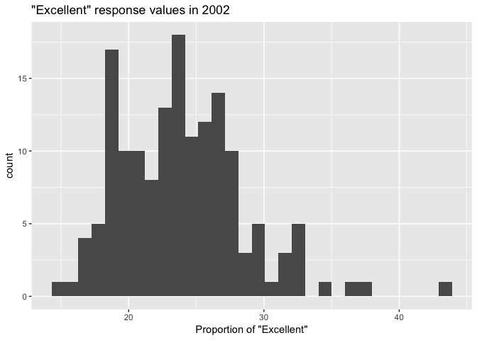
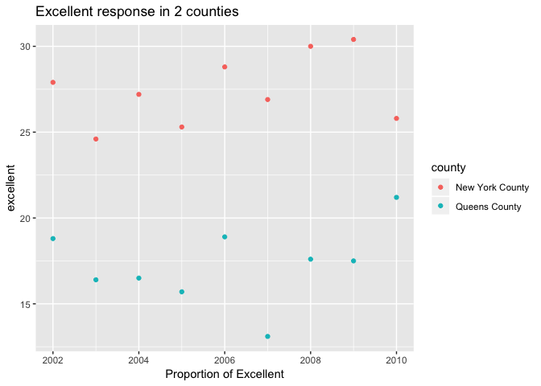

hw2
================
Ditian Li
2018/10/1

Problem 1
=========

``` r
nyc_trans = read_csv("./data/NYC_Transit_Subway_Entrance_And_Exit_Data.csv") %>%
  janitor::clean_names() %>%
  gather(key = route, value = route_line,route1:route11) %>%
  separate(route, into = c("x", "route_number"), sep = 5) %>%
  filter(!is.na(route_line)) %>%
  select(line, station_name, station_latitude, station_longitude, route_number,route_line, entry,     vending, entrance_type, ada) %>%
  mutate(entry = ifelse(entry == 'YES',yes = TRUE,no = FALSE)) %>%
  arrange(line,station_name)
```

    ## Parsed with column specification:
    ## cols(
    ##   .default = col_character(),
    ##   `Station Latitude` = col_double(),
    ##   `Station Longitude` = col_double(),
    ##   Route8 = col_integer(),
    ##   Route9 = col_integer(),
    ##   Route10 = col_integer(),
    ##   Route11 = col_integer(),
    ##   ADA = col_logical(),
    ##   `Free Crossover` = col_logical(),
    ##   `Entrance Latitude` = col_double(),
    ##   `Entrance Longitude` = col_double()
    ## )

    ## See spec(...) for full column specifications.

This dataset contains line, station name, station latitude, station longtitude, entry, vending, entry type, ada, route\_name and route\_number. I first cleaned variable names, then we used mutate to convert variable type and used gather for route variables. After that I used separated function to get route and route line name, then arranged the data. Then dimension is 4270 by 10. The data is not tidy enough, because we have too many columns to show in one row.

``` r
distinct_stations = nrow(distinct(nyc_trans,station_name,line,.keep_all = TRUE))
distinct_stations
```

    ## [1] 465

``` r
ada_compliance = nyc_trans %>%
filter(ada == TRUE) %>%
distinct(station_name,line)
nrow(ada_compliance)
```

    ## [1] 84

``` r
allow_entrance = nyc_trans %>%
filter(entry == TRUE & vending == 'NO') %>%
distinct(line,station_name)
vending = nyc_trans %>%
filter(vending == 'NO') %>%
distinct(line,station_name)
proportion = nrow(allow_entrance)/nrow(vending)
proportion
```

    ## [1] 0.4343434

We have 465 distinct stations, ADA compliant are 84 and there are 43% station entrances / exits without vending allow entrance.

``` r
a_train = nyc_trans %>%
filter(route_line == 'A') %>%
distinct(station_name,line)
nrow(a_train)
```

    ## [1] 60

``` r
a_ada = nyc_trans %>%
filter(route_line == 'A' & ada == TRUE) %>%
distinct(station_name,line)
nrow(a_ada)
```

    ## [1] 17

There are 60 distinct stations serve the A; 17 stations are ADA compliant.

Problem 2
---------

``` r
library(readxl)
trash = read_excel(path = './data/HealthyHarborWaterWheelTotals2018-7-28.xlsx',sheet = 'Mr. Trash Wheel',range = cell_cols("A:N")) %>%
janitor::clean_names() %>%
filter(!is.na(date)) %>%
mutate(sports_balls = as.integer(signif(sports_balls)))
```

``` r
library(readxl)
trash_16 = read_excel(path = './data/HealthyHarborWaterWheelTotals2018-7-28.xlsx',sheet = '2016 Precipitation',range = cell_rows(2:14)) %>%
janitor::clean_names() %>%
mutate(year = 2016)

trash_17 = read_excel(path = './data/HealthyHarborWaterWheelTotals2018-7-28.xlsx',sheet = '2017 Precipitation',range = cell_rows(2:10)) %>%
janitor::clean_names() %>%
mutate(year = 2017)

trash_1617 = bind_rows(trash_16,trash_17) %>%
janitor::clean_names() %>%
select(year, everything()) %>%
mutate(month = month.name[month])
```

Mr. Trash Wheel has 285 observations,key variable is weight\_tons;the 2016-2017 dataset precipitation has 20 observations, the key variable is total precipitation for each month.

The total precipitation in 2017 is 29.93; the median number of sports balls in a dumpster in 2016 is 26.

Problem 3
---------

``` r
devtools::install_github("p8105/p8105.datasets")
```

    ## Skipping install of 'p8105.datasets' from a github remote, the SHA1 (21f5ad1c) has not changed since last install.
    ##   Use `force = TRUE` to force installation

``` r
library(p8105.datasets)
brfss_sm = brfss_smart2010 %>%
janitor::clean_names() %>%
separate(locationdesc, into = c("state", "county"), sep = " - ") %>%
filter(topic == 'Overall Health') %>%
select(-class,-topic,-question,-sample_size,-locationabbr,-(confidence_limit_low:geo_location)) %>%
spread(key = response, value = data_value) %>%
janitor::clean_names() %>%
select(year,state,county,excellent,very_good,good,fair,poor) %>%
mutate(above_good = excellent + very_good)
```

``` r
nrow(distinct(brfss_sm,state,county))
```

    ## [1] 404

``` r
nrow(distinct(brfss_sm,state))
```

    ## [1] 51

``` r
count(brfss_sm,state) %>%
arrange(-n) %>%
head(1)
```

    ## # A tibble: 1 x 2
    ##   state     n
    ##   <chr> <int>
    ## 1 NJ      146

``` r
brfss_sm %>%
filter(year == 2002, !is.na(excellent)) %>%
pull(excellent) %>%
median()
```

    ## [1] 23.6

``` r
brfss_sm %>%
filter(year == 2002) %>%
ggplot(aes(x = excellent)) +
geom_histogram() +
labs(title = '"Excellent" response values in 2002',
x = 'Proportion of "Excellent"')
```

    ## `stat_bin()` using `bins = 30`. Pick better value with `binwidth`.

    ## Warning: Removed 2 rows containing non-finite values (stat_bin).



``` r
brfss_sm %>%
filter(county == 'New York County' | county == 'Queens County') %>%
ggplot(aes(x = year, y = excellent)) +
geom_point(aes(color = county)) +
labs(title = 'Excellent response in 2 counties',
x = 'Proportion of Excellent')
```



There are 404 distinct locations, every state is represented, NJ is the most. In 2002, the median of the “Excellent” response value is 23.6.
